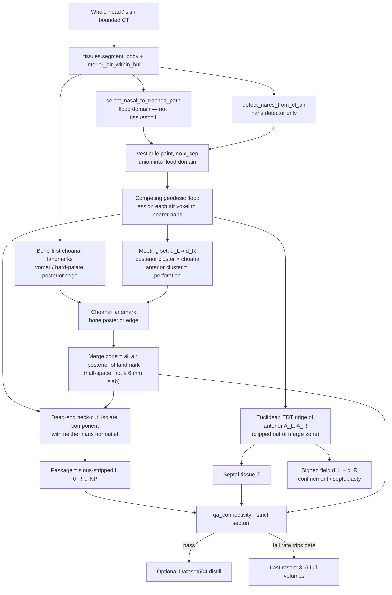
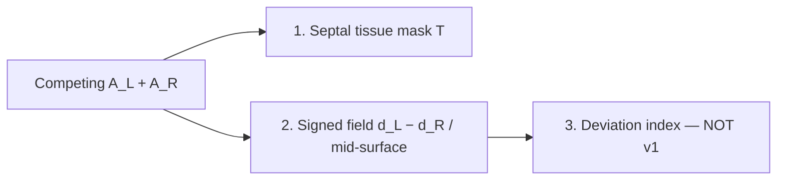
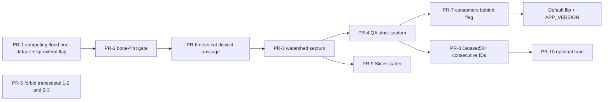

# Segmentation strategy: automatic passage + septum (no slice HITL)

| Field | Value |
|-------|--------|
| **Status** | Partially implemented (2026-08-20). Geometric teacher + CLI exist behind `--no-legacy`; not the demo default. See [`docs/handoff.md`](handoff.md). |
| **Date** | 2026-08-19 |
| **Author** | Engineering (research prototype) |
| **Audience** | Engineers working in this repo |
| **Supersedes (partial)** | Default path in `docs/slicer_labeling.md`; “retrain nnU-Net / Dice vs NasalSeg” reading of `docs/stage1_segmentation_baseline.md` and `docs/nnunet_nasal.md`; “one corrected whole-head label then fine-tune” in `docs/segmentation_method.md` §3.1 item 4 |
| **Does not replace** | `docs/segmentation_method.md` (label taxonomy IDs 0–10 + leftover-air expander + ostia-as-necks) |
| **Related** | `docs/airway_connectivity_limitation.md` (critical), `scripts/qa_connectivity.py`, AGENT_QUEUE **B1**, **A12** |
| **Not a medical device** | Heuristics + CFD preview for research/education only |

---

## Overview

Sinus_CFD turns head CT into a sinus-free inspiratory passage, named sinus air, and a Streamlit surgical-planning demo. The bottleneck is not “more Dice on NasalSeg.” It is **topology**: a connected **bilateral** lumen from both nares through the **choanae** to the nasopharynx/trachea, with a **real septal wall** between the cavities until that join. NasalSeg (Zhang 2024) and the in-repo Dataset501 nnU-Net do not provide that topology. The current CT-native splitter (`split_left_right_by_septum_plane`) defines the septum as the **sagittal plane through the naris midpoint**. A deviated or C-shaped septum is not that plane, so L/R cavities, the septal tissue mask, virtual septoplasty, and streamline confinement are all wrong on the anatomy that matters.

The proposed default is **automatic, whole-head (or skin-bounded) HU + topology**, with **zero slice-wise human-in-the-loop**. L/R cavities are a **competing geodesic flood** (marker-controlled watershed) on a body-bounded, path-restricted air graph **after vestibule paint** (no `x_sep`): every air voxel is assigned to the nearer naris seed. They **partition** the connected whole-head lumen and meet at the choana (and at any perforation). A **bone-first choanal landmark** (vomer / hard-palate posterior edge), confirmed by that posterior meeting set — not NasalSeg label 3 — plus a **merge zone = all air posterior of the landmark** (not a 6 mm slab) marks where mixing into nasopharynx is allowed. Cavity identity, septum ridge, and check 6 use **anterior** L/R only. Ostia leave the passage by a **dead-end** test (through-path thin necks such as the nasal valve stay). Septal **tissue** is the EDT ridge between the two anterior air sets; confinement uses \(\mathrm{sign}(d_L-d_R)\) outside the merge zone. A 3D model is trained **only** as a distillation of that closed geometric teacher after topology QA passes. Manual 3D Slicer labeling of complete volumes is a **gated last resort** (recommend 3–5 volumes), not the plan.

**Independent `binary_propagation` from both nares is not v1.** On Visible Human the lumen is already one 26-component; independent floods would fill the same mask twice.

---

## Background & Motivation

### What CFD and the viewer actually need

From `docs/segmentation_method.md` §1, restated with the missing object this doc owns:

| Object | Role | Must be |
|--------|------|---------|
| **Passage lumen** | Fluid domain, streamlines, resistance | One 26-connected vestibule→outlet tube; **sinus-free**; **both** nares reach the outlet **without** a maxillary or trans-septal shortcut |
| **L / R cavity identity** | Per-side flow, viewer, virtual surgery laterality | Geodesic-Voronoi of the two naris seeds on the air graph; **not** a cut at \(x = (x_L+x_R)/2\) |
| **Septal tissue** | Wall, septoplasty geometry, L/R integrity | Cartilage/bone/mucosa voxels **between** the two air sets; HU not in air range |
| **Septal mid-surface** | Signed-distance field for confinement and septoplasty | A 2D manifold in 3D (planar, C-shaped, or S-shaped). **Not** a sagittal index |
| **Named sinus air** | In-sinus readout, ostial necks | Dead-ends off the passage; leftover-air expander already does v1 **naming**; **neck-cut** of the flooded volume does v1 **exclusion** |
| **Ostial necks** | Stage D paths | Geometry (`ostial_contact_voxels` / `open_path.py`), not a trained pixel class |

Thresholding HU air cannot split passage from sinus: they are one 26-connected component through the ostia (`docs/segmentation_method.md`). Distinguishing L from R cannot be a sagittal cut: the wall between them is the septum, and it is often not planar. Distinguishing L from R also cannot be two *independent* 26-floods: on the intended whole-head path those floods are the same component.

### Current pipeline (what actually runs)

```text
CT
 ├─ NasalSeg crop path: pipeline.process_case
 │     labels {1,2,3}  ──or── Dataset501 nnU-Net
 │     └─ _bridge_through_air(hu_max=-400)   ← P001 failure (2↔3 or 1↔2 medial)
 │
 └─ Whole-head path: process_whole_head.py
       tissues.segment_body + interior_air_within_hull
       select_nasal_to_trachea_path (one lumen, nares→trachea)
       refine_nasal_ct.py → extract_ct_nasal_airway
            detect_nares_from_ct_air
            split_left_right_by_septum_plane   ← sagittal midplane (the septum bug)
            extract_septum_and_walls           ← midplane-guided tissue between L/R
       extend_nasal_to_tip.py                  ← RE-CUTS L/R on naris-mid plane (AGENTS.md step 3)
       segment_sinonasal.expand_named_airspaces  (IDs 6–10 leftover air)
       qa_connectivity.py                      ← no septum-integrity check
                                               ← check 3 vacuous: passage_lumen ≡ airway_mask (A12)
```

Whole-head HU extraction **does** produce a connected bilateral airway on Visible Human (`docs/airway_connectivity_limitation.md`, ~55 mL, one component). The subsequent L/R/septum refine throws that physics away and recuts on a plane; `extend_nasal_to_tip.py` recuts again.

AGENT_QUEUE **A12** (verified): `passage_lumen` is **not** sinus-free — `refine_nasal_ct.py` writes the same array to `*_passage_lumen.nrrd` and `*_airway_mask.nrrd`.

### Pain points (from cited in-repo measurements, not re-counted here)

1. **`docs/airway_connectivity_limitation.md`:** **0 / 130** NasalSeg cases have both cavities 26-connected to nasopharynx via labels `{1,2,3}`, even after morphological closing. This strategy doc does not re-measure that count.
2. **`docs/stage1_segmentation_baseline.md`:** Dataset501 nnU-Net fold-0 held-out airway Dice **0.885 ± 0.137** vs those same labels 1–3 (classical **0.260 ± 0.044**). The same disconnect appears in the predictions. Retraining cannot invent a choana the labels do not contain.
3. P001 HU-air bridge at −400 (`pipeline._bridge_through_air`) connects the right side **through the maxillary sinus** or **across the septum** (R-cavity → NP label 3: 182 / 25,632 NP voxels on the right; ~25-voxel medial gap).
4. CQ500 auto isolation of a nostril plane failed five times: airway is 26-connected to ambient; crop-edge air ≡ room air (`docs/slicer_labeling.md`, AGENT_QUEUE 2026-07-22).
5. `split_left_right_by_septum_plane` documents itself as “the septum plane centered BETWEEN the two nostrils” with \(x_\text{sep} = \mathrm{round}((x_L+x_R)/2)\). That is the primary septum failure mode. `extend_nasal_to_tip.py` then zeros the contralateral half-spaces, so even a correct refine would be undone.

---

## Honest mapping of prior failed approaches

Do not reverse these without new evidence. Each row is a path this repo already tried or already ruled out in-docs.

| Approach | Where | Result | Why it stays rejected |
|----------|-------|--------|------------------------|
| **Retrain nnU-Net on NasalSeg to fix connectivity** | `docs/nnunet_nasal.md`, Dataset501, AGENT_QUEUE B1 naive reading | Held-out airway Dice **0.885** vs labels 1–3; **0/130** bilateral choanal connect (`airway_connectivity_limitation.md`) | Labels do not contain a connected choana or a septum **tissue** class. The model copies the teacher. |
| Morphological closing of `{1,2,3}` | `docs/airway_connectivity_limitation.md` | Stays 2 components | Gap is a missing label region, not a 1-voxel choana. |
| HU-air bridge at −400 on NasalSeg crops | `pipeline._bridge_through_air`, `process_case` default `hu_bridge=True` | Connects, but right-side path through **maxillary sinus** or **across the septum** (including **2↔3**) | Medial unlabeled gap **is** the septum. Bridging any distinct NasalSeg pair through it is the P001 anti-pattern. |
| HU-air region-grow at −200 on NasalSeg crops | connectivity doc | Bilateral connect **and** leak to exterior | Tight crop: nares 26-connect to FOV air. Excluding boundary-connected air deletes the airway. |
| Targeted choanal bridge (air near R-cavity **and** NP) | connectivity doc, P001 | No such air | NP label sits ~25 voxels **across the septum** (182 of 25,632 NP voxels on the right). |
| `tissues.segment_body` on NasalSeg crops | `docs/stage1_segmentation_baseline.md` 3-case spot check | mean Dice **0.067** vs labels 1–3 | Hole-fill needs an enclosed tissue shell **in the array**. ~25% of P001 crop-boundary voxels are air-range HU. |
| `extract_ct_nasal_airway` (current naris-ROI + midplane) on NasalSeg crops | same table | mean Dice **0.064** vs labels 1–3 | Solves a narrower vestibule/septum-split problem (~10k vs ~80k GT voxels), not full cavity+NP. |
| Classical HU threshold + largest components | same, `build_hu_threshold_mask` | Dice **~0.26** vs labels 1–3; **~0.40** with labels 1–5 (`--include-sinuses`, +~0.15) | Lumps maxillary air into the passage. Threshold sweep (−350…−600) barely moves Dice. |
| Hide sinus segments in the viewer | connectivity doc | Removes **right-side flow** on P001 | The only right-side outlet in the bridged domain ran through the sinus. |
| Auto-isolate nostril plane on CQ500 | `docs/slicer_labeling.md`; 5 attempts, ~0 mL | Ambient ↔ nares ↔ cavity is one blob | Topology, not a threshold bug. Needs a **body-bounded** volume, not a tighter crop. |
| Zero-shot Dataset501 on CQ500 | slicer doc, AGENT_QUEUE | Mislocated labels | Domain shift (NasalSeg tight crops → whole-head / different FOV). **Do not put 501 subtract on the VH critical path.** |
| Independent 26-flood from each naris (`binary_propagation` / `label` then keep seed component) | rejected by this revision | On VH, `left_air ≈ right_air ≈ entire connected lumen` | The intended demo path is already one component. Independent floods are not a partition. |
| **SinusSegment (Kaul)** released UNet++ | `docs/segmentation_method.md` | `num_classes=1`, MSE, min–max mask | Binary air blob. Cannot split passage/sinus or L/R. |
| **Craneal_CT / CT-SCOPE (Sun)** | same | Osseous envelope, Dice ~94.8 external; **CC-BY-ND-NC** | Bone, Stage D sidecar only. Do not vendor weights. Do not mix into the air map. |
| **maxsinus / sinusUnet** | same | Skip | Wrong FOV / 2D / one structure Dataset501 already names. |
| **SPESIS** | same, A6 brief | T2 MRI peri-sinus *space* | Homonym. Out of scope. |
| Slice-wise accept/reject, active learning, “is this the septum?” UI | previous implicit B1 direction | Contradicts operator constraint | Default path is automatic. Full-volume Slicer only after numeric QA gates fail. |
| Define septum as naris-mid sagittal plane | `nasal_airway_ct.split_left_right_by_septum_plane` **and** `scripts/extend_nasal_to_tip.py` | Systematic error on deviation; tip script undoes any non-planar L/R | A deviated septum is not \(x=(x_L+x_R)/2\). **Banned** as the definition of the septum (this doc). |
| Pink “septum” high-\|u\| zone as segmentation | `surgical_zones.classify_removal_zones` | Distal-medial heuristic, 7 mm from naris midplane | Not a tissue mask. Keep for demo ranking until the real mask exists; do not train against it. |

**NasalSeg is still useful** as a **class-identity prior** (which air is left cavity vs maxillary) on **NasalSeg-like FOVs**, opt-in and agreement-gated. It is **not** the connectivity source of truth, **not** a septum atlas, and **not** a silent maxillary subtract on whole-head CT.

---

## Why the septum fails today

This is the primary failure mode. It is not a sub-bullet under turbinates.

### Three objects the code currently conflates

| Object | What it should be | What the code does today |
|--------|-------------------|---------------------------|
| **1. Septal tissue mask** | Body voxels of cartilage/bone/mucosa between L and R air | `extract_septum_and_walls`: `dilate(L,3) ∩ dilate(R,3) ∩ tissue`, then gated by a sagittal slab (see exact predicate below) |
| **2. Septal mid-surface** | Non-planar 2D manifold / signed-distance field | **Does not exist.** Everywhere a single index `x_sep` or `_septum_x()` |
| **3. Septal deviation index** | Later (Stage B metrics) | Not required for v1 CFD. Do not block passage work on it |

`surgical_zones.py` “septum” is a **fourth**, unrelated object: high-\|u\| voxels within 7 mm of the naris midplane (`septum_half = 7.0`), distal–medial. Virtual surgery and the viewer treat (2) as a plane derived from L/R **label centroids**, which are themselves midplane cuts — a circular definition.

### The midplane is hard-coded in more than six places

```368:403:src/sinus_cfd/nasal_airway_ct.py
def split_left_right_by_septum_plane(...):
    x_sep = int(round(0.5 * (left_naris_zyx[2] + right_naris_zyx[2])))
    ...
    left = nasal & (xx > x_sep)
    right = nasal & (xx < x_sep)
    # Leave x==x_sep as non-cavity (septum slot)
```

| Site | What it assumes |
|------|-----------------|
| `split_left_right_by_septum_plane` | \(x_\text{sep}\) = naris-x midpoint; L/R are half-spaces; posterior shared air still split by plane |
| `extract_ct_nasal_airway` | Computes `x_sep`, paints vestibules **clipped by that plane**, then calls the splitter |
| `_paint_corridor_to_air(..., x_sep=)` | Refuses to paint left voxels with `q[2] < x_sep` (and vice versa) |
| `extract_septum_and_walls` | See dilated-guide predicate below. `x_sep` from nares if given, else **median of L/R cavity x** (same circularity) |
| **`scripts/extend_nasal_to_tip.py` (AGENTS.md step 3)** | `x_sep = round(0.5*(left_tip[2]+right_tip[2]))`; `_paint_tube` / `_paint_tip_ball` clip on `x_sep`; then **`cl[:,:,:x_sep]=False` and `cr[:,:,x_sep+1:]=False`**. After a non-planar L/R, this script **undoes** it. Soft-air absorb (`hu <= -120` in the tip band) is also half-space split |
| `virtual_surgery._septum_x` | `round(0.5 * (median(x\|label==1) + median(x\|label==2)))` — L/R **label medians**, not naris mid; septoplasty clips growth at that index |
| `surgical_zones.classify_removal_zones` | `x_mid` from naris mm; septum = `lat ≤ 7.0` mm |
| `app/viewer.py` `_compute_streamlines` | `septum_x` from mean L/R label \(x\), then `sign(p[:,0] - septum_x)` |
| `scripts/build_airflow_artifact.py`, `build_viewer_artifact.py` | same `sign(p[:,0] - septum_x)` |
| `open_path.split_frontal_lr` / `compute_surgical_guidance.py` | frontal L/R by **median x** of the frontal mask (`x_mid = median(xx)`) |
| `open_path` dual-centerline “soft symmetry” | blend with **midplane reflection** (`x' = 2 x_mid - x`) — instrument-path heuristic, not a septum definition; leave for a later PR unless it recuts cavities |

On a straight septum this is accidentally OK. On a caudal deviation toward the left naris, the plane sits **in the left vestibule**: left air is truncated, right air includes septal cartilage as “air,” and `extract_septum_and_walls` looks for tissue in the wrong sagittal band. Running `extend_nasal_to_tip.py` then wipes any surviving off-plane cavity voxels.

### Exact `extract_septum_and_walls` predicate (do not “fix” a formula that is not the code)

```python
guide = (xx >= x_sep - half_width) & (xx <= x_sep + half_width)   # half_width default 5; call site 3
septum = between & (guide | morphology.dilation(guide, footprint=morphology.ball(2)))
if int(septum.sum()) < 80:
    septum = between   # fallback only when the guided set is sparse
```

The docstring claims it “keep[s] off-plane CT too.” The code does **not**, unless the guided set has `< 80` voxels. The keep-mask is slightly **wider** than `|x-x_sep|≤half_width` because of `dilation(guide, ball(2))`. Implementers must replace this whole guide, not tighten `half_width`.

### Why “tissue between L and R” cannot save a midplane split

`extract_septum_and_walls` already has the right **primary** predicate (`near_l & near_r & tissue`). It then **throws it away** by gating on the naris-mid slab. Worse: `left_cavity` / `right_cavity` were defined *by that slab*, so “between L and R” is “between two half-spaces,” not “between two anatomically grown cavities.” The circularity is:

```text
define L/R by plane  →  “septum” = tissue between those L/R  →  “septum” hugs the plane
```

A correct extractor **partitions L and R without a plane** (competing geodesic flood), then the tissue that lies between those air sets is the septum.

### Why independent 26-floods also fail (the intended demo is connected)

`process_whole_head.select_nasal_to_trachea_path` already yields **one** 26-component nares→trachea lumen on Visible Human. `ndi.binary_propagation` from the left naris through that air, and from the right naris through the same air, both fill **the entire component**. Then:

- `left_air ∩ right_air` is not a choana — it is the lumen.
- `dilate(L) ∩ dilate(R) ∩ tissue` is a shell around the whole airway; “most posterior tissue in that ridge” is the back of the pharynx, not the vomer.
- \(|d_L-d_R|\le\tau\) with \(d_L\approx d_R\) lights up a thick shell around all air, not the septum.

Independent floods only “look disjoint” on NasalSeg-style **disconnected** labels, which this doc refuses as source of truth. **v1 primitive is a competing flood** (Alt 6 / K13).

### NasalSeg cannot supervise septum

`segmentation_labels.py` IDs 0–10 are **air**. There is no septum tissue class. Dataset501 frozen IDs 1–5 are L/R cavity, NP, L/R maxillary. The medial gap between labels 1 and 2 (and between 2 and 3) is unlabeled background — which `pipeline._bridge_through_air` is willing to fill with HU air. Forbidding only 1↔2 adjacency still allows the P001 **2↔3** punch.

### Whole-head is the existence proof that physics works — and that L/R must *partition* it

Visible Human, segmented by `process_whole_head.py` from CT air on a whole head, yields **one** nares→trachea lumen (~55 mL, one component). Body context lets region-grow control leakage. The missing piece is: **keep that connected lumen, paint vestibules without a plane, partition L/R by competing geodesic flood, derive septum from the anterior interface, mix only in the posterior merge zone, dead-end-cut ostia (not the valve).**

---

## Goals & Non-Goals

### Goals (v1)

1. **Automatic default.** No slice-wise accept/reject. No active-learning ping. No “please confirm this axial.”
2. **Passage topology correct enough for bilateral CFD** on body-bounded whole-head CTs already in `data/` (Visible Human, THCA if present, CQ500 only if the volume is skin-bounded — not the historical tight crop).
3. **Septum tissue + signed-distance mid-surface** derived from CT physics (competing flood + watershed ridge), with hard HU and 26-connect constraints.
4. **Sinuses out of the CFD passage** by **neck-cut of the flooded volume**; named frontal/ethmoid/sphenoid still from the leftover-air expander for *naming*.
5. **Dataset501 remains an optional, agreement-gated identity prior** on NasalSeg-like FOVs, never the connectivity oracle and never a silent whole-head maxillary subtract.
6. **Evaluation is topology + CFD paths + septum integrity**, not Dice vs NasalSeg alone.
7. **Human labels only if numeric QA gates fail** on a defined fraction of the operator’s library; then 3–5 **complete** volumes in 3D Slicer, starter already carved.

### Non-goals (v1)

- Slice HITL, scribble UIs, SAM-style click segmentation, or per-case “is the septum OK?” dialogs.
- Retraining Dataset501 as the connectivity fix.
- Independent `binary_propagation` dual floods as the L/R primitive.
- Replacing nnU-Net with SinusSegment / maxsinus / sinusUnet / SPESIS / Craneal_CT-as-air.
- A learned **septal deviation index** (later; flag mid-surface vs naris-plane disagreement, do not “correct” toward the plane).
- Expert IT / MT tissue classes (keep `surgical_zones` heuristics for pink overlays).
- Ostium pixel class or eustachian-tube air class (`docs/segmentation_method.md` §3.3, A6 brief).
- Treating expander output or this extractor as clinical anatomy.
- Shipping NasalSeg-crop cases as the CFD demo without a body-bounded re-extract (P001 bridged domain stays a known-bad visualization unless re-run on a whole-head living CT).
- Training Dataset504 as a ship gate (research-optional; N≪ typical nnU-Net).

---

## Key Decisions

| # | Decision | Rationale |
|---|----------|-----------|
| K1 | **Default path is automatic geometric extraction** on whole-head / skin-bounded CT. Models distill the extractor; they do not replace it until QA passes. | Operator constraint: no slice confirm/deny. NasalSeg cannot supervise connectivity or septum. Visible Human already shows HU+topology works when the body is in the FOV. |
| K2 | **Do not retrain nnU-Net on NasalSeg to fix airway/septum.** | 0/130 bilateral NP connect (`airway_connectivity_limitation.md`); no septum class; nnU-Net Dice 0.885 is vs **broken** labels. |
| K3 | **Ban the sagittal naris-mid plane as the definition of the septum.** Keep the naris midpoint only as a **naris detector** and as a **disagreement flag**. | `split_left_right_by_septum_plane` is the current bug. Deviated septa are the surgical use case. |
| K4 | **L/R cavities = competing geodesic flood / marker-controlled watershed** on the air graph: every interior-air voxel is assigned to the naris seed with shorter geodesic distance. | Independent 26-floods fill the same connected VH lumen. Competing assignment **is** a split of one component; the banned split is the sagittal plane. |
| K5 | **Three choanal masks:** bone-first **landmark**, **merge zone** = all air posterior of it (half-space), **cavity sets** = competing assignment anterior of it only. Confirmed by the posterior meeting set. **Not** NasalSeg label 3. Not a 6 mm slab as the only legal L/R adjacency. | Label 3 does not span both choanae. A slab-as-gate HARD-fails check 6 on every connected NP. Landmark must not require already-disjoint floods. |
| K6 | **Three septum objects stay distinct:** tissue mask, mid-surface / signed-distance field, deviation index (later). | Downstream consumers need different representations. Conflating them produced the midplane mess. Pathlines never occupy tissue \(M\); confinement is \(\mathrm{sign}(d_L-d_R)\). |
| K7 | **Septal tissue = watershed ridge (or morphological between-set) of Euclidean EDTs of the two anterior cavity sets**, constrained by HU ∉ air and no 26-hole L↔R **outside the merge zone**. Thickness 1–4 mm (cartilage) / thicker bone posteriorly is a **regularizer**, not a crop. | Replaces the midplane `guide \| dilation(guide, ball(2))` in `extract_septum_and_walls` while keeping `near_l ∩ near_r ∩ tissue`. |
| K8 | **Dataset501 is an optional, agreement-gated class prior, not source of truth.** Use L vs R identity where FOV looks like NasalSeg; **discard NP connectivity**; **never bridge distinct NasalSeg classes through the medial gap** (1–2 **or** 2–3 **or** 1–3 **outside the merge zone**). | Explicit P001 anti-pattern. Zero-shot 501 on CQ500 already failed; do not silent-subtract maxillary on VH. |
| K9 | ~~**Exclusion from the CFD passage is a dead-end neck-cut of the flooded volume**~~ → **SUPERSEDED 2026-08-22, see K9a.** Named sinuses stay on the leftover-air expander for *naming*. Dataset503 fine-tune is optional and still without slice HITL. | NasalSeg never labels frontal/ethmoid/sphenoid. Valve MCA is often thinner than a patent ostium. |
| **K9a** | **Exclusion is a widest-path dead-end test + watershed, not a neck-cut.** Sinus = a chamber whose local radius exceeds `SINUS_SEED_RATIO` × its widest-path radius to any opening; extent recovered by watershed on −EDT with per-body markers; a basin touching an opening or the merge zone is passage. | The literal neck-cut was implemented and **measured to fail**: 231 candidate necks on Visible Human isolated **0** terminal-free pockets, and on CQ500CT105 it was intractable (43.5 M voxels × one propagation per neck). VH's maxillary is fused to the cavity through **19** partial-volume perforations — there is no single neck to cut. The widest-path form degrades gracefully there, because many narrow holes still make a narrow maximin bottleneck. Measured: VH 8.9 + 7.0 mL bilateral maxillary; CQ500CT105 3.3 mL against an independent in-FOV measurement of 4.1 mL. |
| K10 | **Self-train a 3D model (Dataset504) only after topology QA on pseudo-labels**, and only as **research-optional**. Teacher = the closed geometric extractor in § Teacher algorithm. If QA fails, **do not train**. | Prevents distilling a collapsed teacher. No operator labels in the loop. 3 whole-head volumes ≪ typical `3d_fullres`; do not block CFD on 504. |
| K11 | **Manual labeling is a last resort:** 3–5 complete 3D Slicer volumes, IDs 0–10 **plus 11 = septum_tissue**, starter provided. Never per-slice yes/no. Triggered only by library-level QA gates below. | Operator *can* label; prefers not to. Previous CQ500 plan becomes the gated fallback, extended with class 11. |
| K12 | **Primary metrics are topological and CFD-path**, not NasalSeg Dice. Dice vs labels 1–3 remains a **class-prior** metric only. | Dice 0.885 did not imply CFD-correct connectivity. |
| K13 | **Do not ship independent `binary_propagation`.** v1 L/R primitive is competing geodesic flood (Alt 6). | Issue 1: intended demo lumen is connected. |
| K14 | **Flood domain = `select_nasal_to_trachea_path` ∪ vestibule paint (no `x_sep`), not `tissues==1`.** Then dead-end neck-cut ostia **inside** that volume. `refine_nasal_ct.py` today passes `interior_air=air_from_tissues`, which includes sinus air. | Path restriction drops disconnected sinus pockets; dead-end test drops ostium-linked ones without amputating the valve. Dataset501 subtract is not on the VH critical path. Paint before compete or sealed 1 mm nares HARD-fail. |
| K15 | **`scripts/extend_nasal_to_tip.py` is on the critical path.** It must consume the same L/R partition (or the same `legacy_midplane_split` flag). Half-space wipes are banned on the new path. | AGENTS.md step 3; would undo PR-1 L/R. |
| K16 | **Product label 11 = `septum_tissue` (not in `PASSAGE_IDS`). Dataset504 is nasal-box slim consecutive 0–6** (septum→6, inverse map 6→11 on inference). No trachea class; whole-head glue stays `select_nasal_to_trachea_path`. Never write `dataset.json` as `0–5 + 11` or a full 0–11 nnU-Net head. | nnU-Net v2 requires consecutive integer labels. User decision 2026-08-19. |

---

## Relation to `docs/segmentation_method.md`

| Doc | Owns |
|-----|------|
| **`segmentation_method.md`** | **What things are named.** Canonical IDs 0–10 (that document’s “11-class map” = background + 10 named air classes), Head A = Dataset501, leftover-air expander for 6–10, ostia as necks, Head B bone later. Still in force. |
| **This strategy** | **How we obtain a trustworthy passage + septum without HITL.** Competing flood, vestibule paint, bone-first landmark + merge zone, dead-end sinus exclusion, watershed septum, QA gates, Dataset504 distillation, last-resort class 11. |

Consequences:

- IDs 1–5 stay frozen (NasalSeg / Dataset501). Do not renumber.
- IDs 6–10 stay expander-filled until/unless Dataset503 exists.
- **New product ID 11 `septum_tissue`** — tissue, not air. Not in `PASSAGE_IDS`. CFD domain remains `{1,2,3}` (and whole-head trachea extension as today).
- Always say **“IDs 0–10 plus 11 `septum_tissue`”** (12 label values). Do not say “11-class air map plus septum = class 11.”
- `label_info` today types `role` as `"background"|"passage"|"sinus"`. Adding `"tissue"` is a **real API change**, not a comment.
- `segmentation_method.md` §3.1 item 4 (“Fix domain shift with **one** corrected whole-head label and fine-tune”) and §6 (“do not start Dataset503 until labels exist” via Slicer correction) are **not** the default for passage/septum. They survive only as the last-resort branch in § Human labeling policy.
- §6 “Turbinates / septum as tissue classes still need new annotation” is **superseded for the septum**: septum is derived from physics, then optionally distilled. Turbinates stay heuristic (`surgical_zones.py`).
- `docs/slicer_labeling.md` remains the **how-to** for the last-resort Slicer session; it is no longer the strategy for getting a working demo.

---

## Proposed Design

### Architecture (v1)



### Named constants (units in mm / mL)

Collect as module-level names in `nasal_airway_ct.py` (analogous to `qa_connectivity.OUTLET_MIDLINE_WARN_MM`). Values are v1 starting points, not anatomy.

| Constant | v1 value | Use |
|----------|----------|-----|
| `AIR_HU_MAX_FLOOD` | −300 HU | Flood medium (conservative wall) |
| `AIR_HU_MAX_VESTIBULE` | −120 HU | Tip paint / `extend_nasal_to_tip` absorb only |
| `PASSAGE_NOT_AIR_HU` | −200 HU | Check 8 / septum-not-air |
| `NARIS_SNAP_RADIUS_MM` | 10.0 mm | Seed snap; spacing-aware, **not** `SNAP_RADIUS_VOXELS` |
| `NASAL_BOX_POSTERIOR_MM` | 90.0 mm | Nasal ROI depth from naris y |
| `NASAL_BOX_Z_HALF_MM` | 35.0 mm | Nasal ROI z half-width about naris |
| `RIDGE_DILATE_MM` | 3.0 mm | Morphological between-set |
| `MIDSURFACE_TAU_MM` | 0.5 mm | \|d_L−d_R\| band |
| `MIDSURFACE_DMAX_MM` | 8.0 mm | Ignore equidistant cheek voxels |
| `TISSUE_NEIGHBORHOOD_MM` | 4.0 mm | \(T\) around \(M\) |
| `THICKNESS_HOLE_MM` | 0.5 mm | Fill PV tunnels |
| `THICKNESS_PEEL_MM` | 12.0 mm | Peel turbinate/pack blobs |
| `SEPTUM_MIN_ML` | 0.3 mL | HARD nonempty |
| `CAVITY_MIN_ML` | 1.0 mL | HARD naris flood nonempty |
| `OSTIUM_NECK_MM` | 2.5 mm | **Candidate** thin-neck caliber for the dead-end test — not a global opening radius |
| `GATE_SLAB_MM` | 6.0 mm | **Visualization only** of the choanal landmark (not the merge zone) |
| `PALATE_MIN_ML` | 0.5 mL | Volume floor for the hard-palate bone CC (teeth speckles lose) |
| `PALATE_ANTERIOR_OF_NARIS_MM` | 10.0 mm | If palate posterior-y is this far *anterior* of the naris → missing palate |
| `SPACING_ISOTROPIC_RATIO_MAX` | 1.05 | `max(spacing)/min(spacing)` above this **requires** spacing-aware geodesic |
| `PALATE_RIDGE_DISAGREE_MM` | 15.0 mm | WARN if bone landmark vs posterior meeting-set disagree |
| `SPECKLE_MIN_ML` | 0.02 mL | Drop islands; **not** “98% of largest” |
| `CHECK8_PV_FRAC` | 0.02 | Passage HU > −200, **excluding documented vestibule voxels** |
| `LIBRARY_FAIL_TRIP` | 0.40 | Last-resort tripwire |
| `LIBRARY_MIN_N` | 3 | Min eligible volumes to trip |

`qa_connectivity.py` stays **import-free of `src/`** (script header contract). Duplicate the few thresholds it needs as script-local constants, or read them from a JSON sidecar the CLI writes — do not `from sinus_cfd... import`.

### A. Airway lumen (passage) without user labels

**Prefer whole-head or skin-bounded HU + topology, not NasalSeg crops.** NasalSeg crops fail `segment_body` because nasal air touches the array boundary (`docs/stage1_segmentation_baseline.md`). Competing flood **requires** a tissue shell so nares are **holes in the body**, not crop-edge air.

#### A.1 Body, path, and interior air (keep; change the refine input)

Reuse:

- `tissues.segment_body` — largest filled tissue.
- `whole_head.interior_air_within_hull` — per-axial convex hull seals in-plane nostril gaps on open-nares living scans.
- `whole_head.select_nasal_to_trachea_path` — **this is the flood domain** (K14). It is already a nares→trachea lumen. It may still include ostium-linked sinus; that is why A.5 neck-cuts **inside** it.

**Change:** `scripts/refine_nasal_ct.py` currently passes `interior_air=air_from_tissues` (`tissues == 1`), which **includes sinus air**. Pass the whole-head airway / `select_nasal_to_trachea_path` mask instead (the `*_airway_mask.nrrd` from `process_whole_head`, or an explicit `*_all_interior_air` only as a superset for sinus *naming*, not for L/R assignment).

**Hard wall:** voxels not in the flood-domain air mask are not assignable. Do not use `pipeline._bridge_through_air` inside this extractor. Do not use **Euclidean** EDT from the two naris *points* to assign air — that punches through septal tissue. Assignment is **geodesic in the air graph**.

Flood HU: `AIR_HU_MAX_FLOOD = -300`. Vestibule painting may use warmer HU (`AIR_HU_MAX_VESTIBULE`) **without** an `x_sep` clip.

**Vestibule paint before competing flood (teacher step 3b):** 1 mm CT often seals the nares (`extend_nasal_to_tip.py`; `extract_ct_nasal_airway` already unions vestibule paint into `interior_air` *before* the L/R split, `nasal_airway_ct.py` ~620–643). The whole-head path is seeded from anterior mid-face air and **need not** include the skin-tip voxels `detect_nares_from_ct_air` returns. Union `_paint_corridor_to_air` (**no** `x_sep`) into the path mask **before** A.3, then snap seeds onto that painted air. `extend_nasal_to_tip.py` remains a **second**, skin-tip pass with the same `legacy_midplane_split` flag (K15) — it must not be the only vestibule paint, or `--no-legacy-midplane-split` HARD-fails sealed VH nares.

#### A.2 Naris seeds (keep detector, drop plane)

Keep `detect_nares_from_ct_air` as **two seed voxels** (and opening masks for BCs). It is **not** allowed to define \(x_\text{sep}\).

`_paint_corridor_to_air` must lose the `x_sep` side clip. Stay in `body` from each seed; competing assignment (A.3) owns laterality. If the two vestibules 26-meet **anterior of the choanal landmark** (outside the merge zone), that is a **QA failure** (perforation), not a cue to insert a plane.

Seed snap: if a seed is not on the air graph **after vestibule paint**, search a ball of radius `NARIS_SNAP_RADIUS_MM` in **physical mm** (spacing-aware), preferring painted vestibule air. Do not reuse `qa_connectivity.SNAP_RADIUS_VOXELS = 10` as millimetres. If still missing, fail the case (HARD) rather than falling back to a midplane split.

#### A.3 Competing geodesic flood (v1 primitive; replaces `split_left_right_by_septum_plane`)

**Not** `ndi.binary_propagation` from each seed independently. **Not** “two floods, not one component split after the fact”: on a connected lumen those are the same thing. v1 **is** a split of one component: a **geodesic Voronoi / marker-controlled watershed**.

```python
def competing_naris_flood(
    air: np.ndarray,  # bool flood domain (z,y,x) — path-restricted
    left_seed_zyx: tuple[int, int, int],
    right_seed_zyx: tuple[int, int, int],
    spacing_xyz: tuple[float, float, float],
    *,
    structure: np.ndarray | None = None,  # default 26-connect
) -> tuple[np.ndarray, np.ndarray, np.ndarray, np.ndarray, list[str]]:
    """Assign every air voxel to the nearer naris seed.

    Distance is geodesic in the 26-connected air graph with **spacing-aware
    edge lengths**. **Not** Euclidean EDT of the seed points (that would punch
    septal tissue). Uniform-cost competing dilation is a **VH-only shortcut**
    when ``max(spacing)/min(spacing) ≤ SPACING_ISOTROPIC_RATIO_MAX`` (1.05);
    it is not the spec on anisotropic CT (CQ500 / living series).

    Returns (left_air, right_air, d_L_mm, d_R_mm, notes).
    left_air and right_air are disjoint and cover ``air`` (ties: d_L <= d_R → L).
    They meet at the choana (posterior) and at any perforation (anterior).
    After A.4, clip cavity sets out of the merge zone — see A.4.
    """
```

Implementation notes:

- **Required:** `skimage.graph.MCP_Geometric` or two Dijkstra on the air lattice with edge length \(\sqrt{(s_z\Delta z)^2+\cdots}\) unless spacing is nearly isotropic (`max/min ≤ 1.05`). Iterated competing dilation (first arriver wins) is allowed **only** as that isotropic shortcut.
- `d_L`, `d_R` are geodesic millimetres in air. Store them; confinement and meeting-set use these, not Euclidean-to-seed.
- Nasal box (`NASAL_BOX_*`) may *crop the graph* for speed; do not use the box as a laterality prior.
- Call this **after** vestibule paint is unioned into `air` (A.1 / teacher 3b).

Properties on a **connected** lumen (the VH case):

- Full-graph \(A_L \cap A_R = \emptyset\) by construction, but they **stay 26-adjacent along the geodesic midline through NP/trachea**. That adjacency is **not** a septum failure — A.4 clips cavity sets to **anterior of the landmark**.
- Meeting set \(S = \{v\in\mathrm{air}: |d_L-d_R| \le \tau_\text{meet}\}\) (or 26-neighbors with opposite labels) clusters into **posterior choana** (should fall in/near the landmark) and any **anterior perforation**.
- `dilate(A_L^\text{ant}) ∩ dilate(A_R^\text{ant}) ∩ tissue` is a **thin band along the septal wall**, not a shell around the pharynx.

**Required tests (PR-1):**

1. Planar septum slab, two cavities, **disconnected** except a posterior choana — one 26-component overall. Competing flood partitions; independent `binary_propagation` (if coded as a negative fixture) fills both sides identically.
2. C-shaped septum — midplane split mis-assigns ≥ 20% of one cavity; competing flood does not.
3. Anterior 1-voxel perforation — meeting set has an anterior cluster; QA check 6 would HARD-fail (do not auto-heal with a plane).
4. Sealed-naris: path lumen does not reach the array-anterior seed until a 3-voxel vestibule tube is painted; competing flood must **not** HARD-fail after step 3b.
5. Anisotropic spacing (`max/min > 1.05`): assignment must use spacing-aware geodesic, not competing dilation.

PR-1 **does not** flip `extract_ct_nasal_airway` to this path as the default (K / Rollout).

#### A.4 Choanal join — three masks, not a 6 mm slab

**Rule:** L and R cavity **identity** stops at the choanal landmark. All flood-domain air **posterior** of that landmark is nasopharynx (shared). A 6 mm slab cannot be both the only place L/R adjacency is allowed and a thin landmark: competing assignment stays 26-adjacent along the NP/trachea midline, so check 6 would HARD-fail every connected whole-head case.

**Three masks (split; do not conflate):**

| Mask | Definition | Feeds |
|------|------------|-------|
| **1. Landmark** | Bone posterior edge (palate / vomer), a coronal-ish **cut** at one y (orientation-aware). `GATE_SLAB_MM` is **viz-only** of this cut | Meeting-set confirmation; `*_choanal_landmark.nrrd` |
| **2. Merge zone** | **All** flood-domain air **posterior of** the landmark (half-space, not a 6 mm slab) | NP / trachea union; confinement “posterior → mixing allowed” |
| **3. Cavity sets** | Competing assignment **anterior of the landmark only**: \(A_L^\text{ant}=A_L\cap\neg\mathrm{merge}\), \(A_R^\text{ant}=A_R\cap\neg\mathrm{merge}\) | Check 6, septum ridge, \(T\), \(M\), \(\mathrm{sign}(d_L^g-d_R^g)\) confinement |

Posterior air is **`nasopharynx`** (not labeled as cavity) for integrity, ridge, and confinement. Optional Voronoi coloring of NP is **display-only** and **must not** feed check 6.

**Do not** use NasalSeg label 3. **Do not** derive the landmark from `dilate(L)∩dilate(R)∩tissue` as primary.

**Bone-first landmark (does not require disjoint L/R):**

1. **Hard palate (v1):** among bone voxels (`hu ≥ tissues.DEFAULT_HU["bone_min"]` = 300) in the **inferior nasal box**, take the **largest 26-connected component by volume** whose volume ≥ `PALATE_MIN_ML` (0.5 mL). Inferior = low z if `superior_is_high_z` else high z (must pass that flag; `whole_head.py` already uses it). Posterior edge = max y if `y_anterior_is_low` else min y. If that posterior y is **anterior of the naris** by more than `PALATE_ANTERIOR_OF_NARIS_MM` (10 mm), treat as **missing palate** (teeth/maxilla won or FOV). A more-anterior high-HU blob (teeth) must **not** win — volume floor + inferior box + “posterior edge anterior of naris → missing” are the guards.
2. **Vomer / posterior septal bone:** search window ~15 mm about naris-mid x **only** to find the bony septum, then take its **posterior** edge. Landmark hunt, not an L/R split.
3. **Landmark y:** more posterior of (palate posterior edge, vomer posterior edge). **v1 is a coronal y-cut** (not a 6 mm slab; not a ridge surface). Merge zone = all air posterior of that cut. WARN if L vs R meeting y differ by > 10 mm (oblique choanae).
4. **Confirmation:** posterior cluster of the competing-flood meeting set should fall in/near that y (within `PALATE_RIDGE_DISAGREE_MM`). If they disagree, **prefer bone** and WARN.

**Failure modes (must be unit-tested):**

| Case | Behavior |
|------|----------|
| Connected choana, palate present | Landmark at palate/vomer posterior; merge zone = all air posterior; meeting set confirms |
| Anterior perforation | Meeting set has an anterior cluster; landmark still posterior; check 6 HARD-fails on **anterior** \(A_L,A_R\) |
| Missing palate (cadaver FOV / posterior-y anterior of naris) | Fall back to vomer posterior edge; if that missing, fall back to **posterior meeting cluster**; WARN |
| Extra high-HU blob (teeth) more anterior than the true plate | Palate CC volume floor + inferior box; teeth must not win |
| Empty meeting set (NasalSeg-style disconnected L/R) | Landmark from bone only; merge zone may stay empty — honest disconnect |
| Landmark/meeting posterior of trachea | HARD fail (search escaped the nasal box) |
| Oblique choanae | v1 y-cut may clip one side; WARN. No ridge-surface gate in v1 |

```python
def choanal_gate_from_bone(
    hu: np.ndarray,
    bone: np.ndarray,
    body: np.ndarray,
    left_seed_zyx: tuple[int, int, int],
    right_seed_zyx: tuple[int, int, int],
    *,
    y_anterior_is_low: bool,
    superior_is_high_z: bool,
    spacing_xyz: tuple[float, float, float],
    meeting_set: np.ndarray | None = None,
) -> tuple[np.ndarray, np.ndarray, dict]:
    """Bone-first landmark + merge-zone (posterior half-space).

    Returns (landmark_mask, merge_zone, meta). meeting_set is confirmation only.
    ``superior_is_high_z`` is required to define the inferior nasal box.
    No x_sep anatomy.
    """
```

**Merge / clip procedure:**

- **Cavity identity:** \(A_L^\text{ant}, A_R^\text{ant}\) as above. 26-adjacency between those two **outside the merge zone** → HARD fail (perforation).
- **Nasopharynx:** `nasopharynx_air = flood_domain ∩ merge_zone`. For the **passage** they union with the cavities. Whole-head trachea continues via existing `select_nasal_to_trachea_path`.
- Display L/R **inside** the merge zone may still be Voronoi; it is not an integrity input.

#### A.5 Sinus strip — dead-end neck-cut (not caliber-to-naris)

Ostium-connected sinus air **will** be in the competing assignment (it is on the air graph). After that, leftover interior air **not** in the flood domain is at most *disconnected* sinus. `expand_named_airspaces` on that leftover can **name** disconnected pockets; it **cannot** un-merge maxillary that was already assigned.

**Caliber alone cannot tell an ostium from the nasal valve.** Valve MCA is often smaller than a patent ostium. Global morphological opening at `OSTIUM_NECK_MM` (2.5 mm radius ≈ 5 mm diameter) amputates an obstructed passage. A geodesic-to-naris bottleneck treats “everything behind a narrow valve” as sinus. `select_nasal_to_trachea_path` keeps the component that touches **both** nostril and trachea seeds, so ostium-linked maxillary *is* in the flood domain — exclusion is required — but the discriminator is **dead-end vs through-path to the outlet**, not caliber. Do **not** copy the stage1 sketch (“split off components whose connection to the seed passes through a narrow bottleneck”) blindly. Do **not** ship PR-6 with “opening OR geodesic-to-naris” as an implementer choice.

**v1 exclusion (dead-end test; one algorithm):**

1. Restrict to flood-domain air (path-restricted + vestibule paint, K14 / 3b). Include naris seeds **and** the trachea/outlet seed.
2. Spacing-aware EDT **inside** that air (radius to wall). Find **candidate necks** as local minima of radius along a skeleton or `open_path` most-open path (`OSTIUM_NECK_MM` is the **candidate** caliber, not a global open).
3. **Dead-end test:** a candidate neck is an ostium iff **cutting it** (remove a 1-voxel-thick cut at that minimum, or a ball of radius `OSTIUM_NECK_MM` *at that neck only*) isolates a 26-component that contains **neither** naris seed **nor** the trachea/outlet seed. That isolated component is sinus.
4. A thin neck that still lies on a remaining **naris→outlet** path is **passage**, even if its caliber is `< OSTIUM_NECK_MM` (nasal valve / meatus).
5. `passage = flooded_air & ~sinus_candidate`. Name sinus components with the expander / Dataset501 if agreement-gated.
6. **File contract depends on the flag (check 2 must not landmine default CI):**
   - `legacy_midplane_split=True` (default until VH `--strict-septum`): **do not** rewrite `*_passage_lumen.nrrd` to a distinct strip. Keep today’s byte-identical write (A12). Check 2 stays on `airway_mask`.
   - `legacy_midplane_split=False`: write **distinct** `*_passage_lumen.nrrd` (sinus-stripped) vs `*_airway_mask.nrrd` (whole-head path / pre-strip). Check 3 under `--strict-septum` is the only check that requires that distinct sinus-free passage.

**Dataset501 maxillary subtract:** **opt-in**, NasalSeg-like FOV or explicit `--nnunet-maxillary`. Require overlap agreement (e.g. Dice vs `sinus_candidate` ≥ 0.3, or 501 maxillary ⊂ nasal crop). On disagreement, **ignore 501** and keep the dead-end cut. **Not on the Visible Human critical path.** Zero-shot 501 on CQ500 already failed.

#### A.6 Dataset501 role (narrow)

```text
Dataset501  →  identity prior on NasalSeg-like FOVs, agreement-gated
            ↛  choanal connectivity
            ↛  permission to fill the medial gap
            ↛  septum tissue
            ↛  silent maxillary subtract on whole-head / CQ500
```

If Dataset501 L/R disagree with the competing flood on a voxel: prefer **flood** for topology. If Dataset501 paints NP across the medial gap into the contralateral cavity, **discard that NP**.

### B. Septum — learn without slice labeling

#### B.1 Three objects (do not conflate)



**1. Septal tissue mask** — STL + product class 11.  
**2. Signed-distance / mid-surface** — confinement and septoplasty. Pathlines live in **air**; they never occupy tissue \(M\).  
**3. Deviation index** — later. v1 only **logs** distance between \(M\) and the naris-mid plane. Large disagreement is a **feature**.

#### B.2 Geometric extractor (zero new human labels)

Replace the midplane guide in `extract_septum_and_walls`; stop taking `x_sep` as anatomy.

Two distance fields (do not mix them):

| Field | Meaning | Use |
|-------|---------|-----|
| \(d_L^g, d_R^g\) | Geodesic-in-air from naris seeds (A.3) | Assignment, meeting set, **streamline confinement** \(\mathrm{sign}(d_L^g-d_R^g)\) |
| \(d_L^e, d_R^e\) | Euclidean EDT of the assigned **air sets** \(A_L, A_R\) (spacing-aware) | Tissue ridge: a tissue voxel’s distance to nearest L air vs R air |

**Mid-surface voxels** (discrete, tissue):

\[
M = \{\, v \mid |d_L^e(v)-d_R^e(v)| \le \texttt{MIDSURFACE\_TAU\_MM},\; \min(d_L^e,d_R^e) \le \texttt{MIDSURFACE\_DMAX\_MM},\; v \in \text{tissue} \,\}
\]

Restrict \(M\) and \(T\) to **anterior of the choanal landmark** (cavity sets \(A_L^\text{ant}, A_R^\text{ant}\); not the merge zone) so the ridge does not collapse in NP.

**Tissue:**

\[
T_0 = \mathrm{dilate}(A_L, r) \cap \mathrm{dilate}(A_R, r) \cap \text{tissue} \cap \mathrm{ROI}
\quad r=\texttt{RIDGE\_DILATE\_MM}
\]
\[
T = T_0 \cap \mathrm{dilate}(M, \texttt{TISSUE\_NEIGHBORHOOD\_MM})
\]

This is `between = near_l & near_r & tissue & roi` **without** `guide | dilation(guide, ball(2))`.

**Hard constraints:**

| Constraint | Test | Repair if violated |
|------------|------|--------------------|
| Not air | \(T\) voxels have `hu > PASSAGE_NOT_AIR_HU` (−200) | Drop `hu ≤ -200` |
| No punch | `dilate26(A_L^\text{ant}) ∩ A_R^\text{ant} == ∅` | Fill 1-voxel air tunnels into \(T\); do not open them |
| Thickness regularizer | EDT of \(T\): cartilage prior 1–4 mm | Do not crop to 4 mm. Thickness `< THICKNESS_HOLE_MM` over a run > 3 mm → fill. Blob `> THICKNESS_PEEL_MM` → peel to ridge neighborhood |
| Nonempty | vol(\(T\)) ≥ `SEPTUM_MIN_ML` | HARD fail |

Light `morphology.closing(T, ball(1))` only inside `tissue`. **Banned:** `x_sep` as a keep-mask.

#### B.3 Mid-surface consumers — signed distance, not mesh intersection

| Consumer | Today | After |
|----------|-------|--------|
| L/R **display** of leftover nasal air | `xx > x_sep` | Assigned \(A_L, A_R\) / \(\mathrm{sign}(d_L^g-d_R^g)\). Do not recut with a plane. |
| Streamline confinement (`viewer._compute_streamlines`, `build_*_artifact.py`) | `sign(x - septum_x)` | **Anterior of the landmark / outside the merge zone:** drop or stop a sample when \(\mathrm{sign}(d_L^g-d_R^g)\) **flips relative to its seed naris**. **Inside the merge zone**, allow mixing. **Do not** require intersection with tissue \(M\) in v1 (pathlines never occupy \(T\)). |
| `virtual_surgery.septoplasty` | clip at `_septum_x` index | Grow obstructed-side air into tissue voxels with \(d_{\mathrm{ipsi}}^e > d_{\mathrm{contra}}^e\) until \(T\). Lateral/medial = away-from / toward the signed field, not ±x. If \(T\) missing, **refuse** with an error. |
| `surgical_zones` pink “septum” | 7 mm from naris plane | **Leave unchanged in PR-1–7.** Do not AND with tissue mask \(T\). |
| `extend_nasal_to_tip.py` | half-space wipe at `x_sep` | Paint vestibules; assign new voxels by \(\mathrm{sign}(d_L^g-d_R^g)\) (or nearest assigned cavity). **No** `cl[:,:,:x_sep]=False`. Same `legacy_midplane_split` flag as refine. |

#### B.4 Self-training (Dataset504) — after QA; research-optional

Teacher must be the **closed** algorithm in § Teacher algorithm. Distilling independent floods would bake L/R collapse into 504.

**Train gate:** every training volume passes HARD topology checks. If fewer than **3** volumes pass, **do not train**; keep the geometric extractor as the product. Three whole-heads (two cadavers + one living if THCA exists) is **not** a serious `3d_fullres` set. Alt 5 stands: **do not block CFD on 504.**

**Dataset504 label IDs (nnU-Net consecutive):**

Slim v1 `dataset.json` (legal consecutive 0–6):

| nnU-Net ID | Name | Inverse map to product |
|------------|------|------------------------|
| 0 | background | 0 |
| 1 | left_nasal_cavity | 1 |
| 2 | right_nasal_cavity | 2 |
| 3 | nasopharynx | 3 |
| 4 | left_maxillary_sinus | 4 |
| 5 | right_maxillary_sinus | 5 |
| **6** | **septum_tissue** | **11** |

`dataset504_json()` emits this slim map and an `inverse_label_map` of `{6: 11}`. Empty 4/5 allowed. **Never** `{11: septum}` with a gap at 6–10. Do not use a full 0–11 nnU-Net head.

**FOV:** Dataset504 is **nasal-box** (IDs 0–6 as above). Label 3 is nasopharynx in that box, not trachea. Whole-head glue to trachea remains classical HU topology (`select_nasal_to_trachea_path`).

Hold out **at least one** passing whole-head (prefer living) for student topology QA. Never report NasalSeg Dice as the 504 headline. Never score student vs teacher on the **same** volumes as the ship metric.

**Weak NasalSeg use:** L vs R identity on NasalSeg-like FOVs only. Discard NP connectivity. Never bridge distinct classes through the medial gap.

### C. Named sinuses

Unchanged v1 **naming**: `expand_named_airspaces` leftover HU air, never overwrite IDs 1–5. After competing flood, leftover is *disconnected* pockets; ostium-linked sinus was already in the flood and was **neck-cut** (A.5), not named from leftover.

Split leftover frontal/ethmoid by touch-to-\(A_L\)/\(A_R\) or \(\mathrm{sign}(d_L^g-d_R^g)\), not `_split_lr` on `x_mid`, when floods are provided.

Ostia = dilated sinus ∩ passage. Dataset503 optional, still without slice HITL, only if expander QA fails systematically.

### D. Human labeling policy (last resort)

Operator **can** manually segment from their CT library. Default is that they **do not**.

#### D.1 When we are allowed to ask

The 40% tripwire is **not measurable** until competing flood + gate + neck-cut + septum masks exist (PR-1, PR-2, PR-6, PR-3) and QA can SKIP vs HARD (PR-4). Do not compute it on midplane L/R.

| Gate | Threshold to trip last-resort |
|------|-------------------------------|
| Library HARD-fail rate | **≥ 40%** of eligible volumes fail any HARD check, **and** at least **3** eligible volumes were evaluated **with the new extractor** |
| Or: primary demo | Visible Human Female **HARD-fails** `--strict-septum` after the extractor is implemented (not a pre-existing midplane result) |
| Or: extractor empty | Septum tissue \(<\) `SEPTUM_MIN_ML` or either assigned cavity \(<\) `CAVITY_MIN_ML` on **two consecutive** distinct living whole-heads |

**Do not trip because:** NasalSeg Dice is low; mid-surface disagrees with the naris-mid plane; a single slice looks ugly; Dataset501 NP is disconnected; CQ500 tight crop fails (ineligible).

#### D.2 What we ask for (never slice yes/no)

- **N = 3–5 complete volumes** (not 3–5 slices). Whole-head or sinus FOV that includes skin.
- 3D Slicer Segment Editor, carve-the-starter (`docs/slicer_labeling.md`).
- Starter: geometric extractor + expander; label map **IDs 0–10 plus 11 `septum_tissue`**.
- One NIfTI/NRRD per volume, geometry matched to the CT.

#### D.3 What we never build

Per-slice accept/reject UI; active-learning uncertain slices; “click the septum”; using last-resort labels to **define** the competing-flood algorithm.

### E. Evaluation (must not be only Dice vs NasalSeg)

Extend `scripts/qa_connectivity.py`. Keep it import-free of `src/`. Checks 4–5 stay advisory as today.

| ID | Check | Severity | Pass criterion |
|----|-------|----------|----------------|
| 1 | Single 26-component **passage** | HARD (existing) | 1 component. Speckles: drop islands `< SPECKLE_MIN_ML` (0.02 mL) **before** the count; do **not** invent a “largest ≥ 98%” rule |
| 2 | Both nares → outlet through **airway_mask** | HARD (existing) | Stay on `airway_mask` (whole-head path / pre-strip) **until the default flip**. Do **not** retarget check 2 at `passage_lumen` when PR-6 writes a distinct file — that would fail default CI if a nasal-box passage omits the tracheal outlet or a neck-cut is aggressive. |
| 3 | No sinus shortcut | HARD **only** under `--strict-septum` **and** after PR-6 on the **non-legacy** path | `*_passage_lumen.nrrd` exists, is **not** byte-identical to `*_airway_mask.nrrd` (A12), is sinus-free, and itself connects nares→outlet. If passage missing, byte-identical (legacy path), or **maxillary labels absent** → **SKIP**, never PASS. This is the **only** check that requires a distinct sinus-free passage. |
| 6 | Anterior L/R not 26-adjacent outside merge zone | HARD under `--strict-septum` | `dilate26(A_L^\text{ant}) ∩ A_R^\text{ant} == ∅` (cavity sets already exclude the merge zone). SKIP if L/R or landmark/merge-zone masks absent. **Do not** test full-graph Voronoi L/R against `¬gate_slab` — NP adjacency is expected. |
| 7 | Septum nonempty, not air | HARD under flag | vol(\(T\)) ≥ 0.3 mL; fraction of \(T\) with `hu ≤ -200` ≤ 2%. SKIP if no septum mask |
| 8 | Passage HU | HARD under flag | Of passage voxels **excluding documented vestibule / tip-paint voxels** (`extend_nasal_to_tip` notes, `hu ≤ AIR_HU_MAX_VESTIBULE` in tip band): fraction with `hu > -200` ≤ `CHECK8_PV_FRAC`; 0% with `hu > 0`. Vestibule paint (`_paint_corridor_to_air` `air_hu_max+80`, tip `hu<=-120`) would otherwise false-fail |
| 9 | Septum lies between L and R | HARD under flag | ≥ 90% of \(T\) have both \(d_L^e, d_R^e\) ≤ 8 mm |
| 10 | Mid-surface vs naris-mid plane | INFO | Mean distance (mm) + Hausdorff; **do not fail** if large |
| 11 | Ostial contacts | WARN | 0 allowed (opacified) |
| 12 | CFD pathlines | HARD on demo case under flag when streamlines **and** maxillary labels exist | No pathline spends ≥ 5 mm arc length in maxillary labels; no pathline flips \(\mathrm{sign}(d_L^g-d_R^g)\) **outside the merge zone**. If maxillary labels absent → **SKIP**, not PASS |

`--strict-septum` stays **off** until Visible Human passes these checks. Do not promote check 3 in default CI while A12 holds.

**Class-prior metric (not a ship gate):** Dataset501 Dice vs NasalSeg labels 1–5 on fold-0, as today.

**Synthetic unit tests** (`tests/test_septum_topology.py`):

1. Planar septum + **one** connected lumen with posterior choana.
2. C-shaped septum (midplane fails; competing flood passes).
3. 1-voxel trans-septal hole (anterior meeting cluster; filler / HARD QA).
4. Choana opening posteriorly; mixing only in merge zone.
5. **Dead-end vs valve:** narrow valve (1.5 mm) on the **through-path** naris→outlet **and** a 2 mm ostium into a maxillary pocket → only the pocket leaves `passage_lumen`; the valve stays in passage.
6. Missing palate / teeth blob more anterior than the true plate → vomer / meeting-set fallback, WARN; teeth CC must not win.
7. Independent-flood negative fixture: on test (1), `binary_propagation` from both seeds yields Dice(L,R) ≈ 1; competing flood Dice(L,R) ≈ 0.
8. Sealed naris until a 3-voxel vestibule tube is painted (teacher 3b); competing flood must not HARD-fail.
9. Connected NP: check 6 **passes** when \(A_L^\text{ant}, A_R^\text{ant}\) are used; **fails** if implemented as `dilate26(A_L) ∩ A_R ∩ ¬slab`.

---

## Teacher algorithm (closed; Dataset504 may only distill this)

Order is binding. This is the object K10 refers to.

1. **Body + hull air** (`segment_body`, `interior_air_within_hull`).
2. **Flood domain** = `select_nasal_to_trachea_path` (not `tissues==1`).
3. **Naris seeds** = `detect_nares_from_ct_air`.
3b. **Vestibule paint** (`_paint_corridor_to_air`, **no** `x_sep`) unioned into the flood domain; then snap seeds onto that painted air (`NARIS_SNAP_RADIUS_MM`). Required on 1 mm sealed nares; `extend_nasal_to_tip.py` is a later skin-tip pass, not this step.
4. **Competing geodesic flood** (spacing-aware unless isotropic) on the **painted** domain → \(A_L, A_R, d_L^g, d_R^g\) (disjoint partition of the full graph).
5. **Bone-first choanal landmark** (`superior_is_high_z` + largest palate CC); **merge zone** = all air posterior of landmark; clip cavity sets \(A_L^\text{ant}, A_R^\text{ant}\). Confirm landmark with posterior meeting set.
6. **Dead-end neck-cut** ostia **inside** the flooded volume (isolate component with neither naris nor outlet); write distinct `passage_lumen` **only** when `legacy_midplane_split=False`.
7. **Euclidean EDT ridge** of the **anterior-of-landmark** cavity sets → \(T\), \(M\), \(d_L^e-d_R^e\).
8. **HARD QA**; only passing volumes may become Dataset504 teachers.

If any step HARD-fails, do not invent a sagittal plane, do not train, do not silent-subtract Dataset501.

---

## Learning without operator labels

```text
Teacher  = the closed algorithm above (body, path-restricted air graph,
           vestibule paint, competing geodesic flood, bone-first landmark
           + merge zone, dead-end neck-cut, EDT ridge)
Students = (optional) Dataset504 nnU-Net, consecutive IDs, remap 6→11
Human    = last-resort complete volumes iff QA tripwire fires
NasalSeg = identity prior only on NasalSeg-like FOVs, agreement-gated
```

**Sources of signal, in order:** (1) topology of air vs tissue; (2) naris geometry as seeds; (3) vestibule paint into the air graph (no plane); (4) bone landmarks for the choanal cut; (5) Dataset501 class names, gated; (6) self-training of QA-passing teachers; (7) 3–5 Slicer volumes only after D.1.

**Not a source of signal:** NasalSeg label 3 connectivity; `_bridge_through_air` filling the medial gap; operator accept/reject; pink `surgical_zones` septum; distance to the naris-mid plane; independent 26-floods.

---

## API / Interface Changes

### `src/sinus_cfd/nasal_airway_ct.py`

| Symbol | Change |
|--------|--------|
| Module constants | Named mm/mL constants from the table above |
| `competing_naris_flood` | **Add** (v1 primitive) |
| `split_left_right_by_septum_plane` | Keep for `--legacy-midplane-split` (default **on** until VH `--strict-septum` passes) |
| `choanal_gate_from_bone` | **Add.** Returns `(landmark, merge_zone, meta)`; requires `superior_is_high_z`; `meeting_set` confirmation only |
| `neck_cut_passage` | **Add.** Dead-end test (isolate component with neither naris nor outlet). Distinct `passage_lumen` **only** when `legacy_midplane_split=False` |
| `extract_septum_and_walls` | Drop `x_sep` as anatomy. Watershed + constraints |
| `extract_septum_midsurface` | **Add** \(M\) plus expose \(d_L^g, d_R^g\) for confinement |
| `_paint_corridor_to_air` | Remove `x_sep` side clip on the new path |
| `extract_ct_nasal_airway` | Add `legacy_midplane_split: bool = True` (default **True**). New path: path-domain → vestibule paint (no `x_sep`) → competing flood → bone landmark + merge zone → dead-end neck-cut → ridge. Wire only when flag is False |
| `CTNasalAirwayResult` | Add `septum_midsurface`, `choanal_landmark`, `merge_zone`, `nasopharynx`, `d_left_mm`, `d_right_mm`, `legacy_midplane_split`. Meta: `x_naris_mid` as disagreement reference only |

### `scripts/refine_nasal_ct.py`

- `--legacy-midplane-split` / `--no-legacy-midplane-split`; default **legacy on**.
- Pass path-restricted air, not `tissues==1`, when not legacy.
- Write `*_septum_midsurface.nrrd`, `*_choanal_landmark.nrrd`, `*_merge_zone.nrrd`. Distinct `*_passage_lumen.nrrd` **only** when `--no-legacy-midplane-split`; on the legacy path keep today’s byte-identical `passage_lumen` ≡ `airway_mask` so check 2 is unchanged.
- Persist `legacy_midplane_split` in `*_ct_nasal_meta.json` so tip-extend and viewer share one flag.

### `scripts/extend_nasal_to_tip.py` (critical path, K15)

- Read `legacy_midplane_split` from meta (CLI override).
- **Legacy on:** keep today’s `x_sep` wipes (bit-identical rollback).
- **Legacy off:** remove `cl[:,:,:x_sep]=False` / `cr[:,:,x_sep+1:]=False`; assign new vestibule voxels by \(\mathrm{sign}(d_L^g-d_R^g)\) or nearest cavity; keep `AIR_HU_MAX_VESTIBULE` absorb without half-spaces.
- Same `--legacy-midplane-split` name as refine (one rollback CLI family).

### `src/sinus_cfd/segmentation_labels.py`

```python
SEPTUM_TISSUE = 11
LABEL_NAMES[11] = "septum_tissue"
# PASSAGE_IDS unchanged: (1, 2, 3)
# label_info(11): role="tissue"  # API: role union gains "tissue"
def dataset504_json() -> dict:
    # consecutive 0–6 slim + inverse_label_map {6: 11}
```

### `src/sinus_cfd/pipeline.py`

- `forbid_transseptal` on **`process_case` / NasalSeg-crop path only** — whole-head refine does not call `_bridge_through_air`. Do not describe it as a whole-head default.
- Pass the **label map** (not only the boolean union of `{1,2,3}`) into the bridge.
- Forbidden fill = any new air voxel that 26-connects **distinct** NasalSeg classes through the unlabeled medial band: **1–2 or 2–3 or 1–3**, unless the voxel is in a merge zone posterior of a choanal landmark (crops usually have none → forbid all three).
- Honest outcome: NasalSeg-crop CFD may stay disconnected on the right.

### `src/sinus_cfd/virtual_surgery.py`

- `_septum_x` → signed-field / \(T\) clip. Refuse if \(T\) missing.

### `src/sinus_cfd/segment_sinonasal.py`

- Leftover L/R split when floods provided: \(\mathrm{sign}(d_L^g-d_R^g)\), not `_split_lr` on `x_mid`.
- Expander stays air-only; does not write 11. `_copy_named` still drops `>5`; a **new merge step** writes 11.

### `scripts/qa_connectivity.py`

- Checks 6–12 as in § E. `--strict-septum`. Check 2 remains on `airway_mask` until default flip. Check 3 SKIP if passage missing, byte-identical, or no maxillary labels. Check 6 uses **anterior** cavity sets vs merge zone, not a 6 mm slab.
- No `src/` import.

### Viewer / artifacts

- Confinement: \(\mathrm{sign}(d_L^g-d_R^g)\) **outside the merge zone**; honor `legacy_midplane_split` from meta until the default flips.
- **Bump `APP_VERSION` when L/R masks change meaning** (default flip), not only when new overlays are shown. Today: `0.17.0-mvp-geometry` in `app/viewer.py`.

---

## Data Model Changes

### Label map

| ID | Name | Role | v1 source |
|----|------|------|-----------|
| 0–10 | as `LABEL_NAMES` | air taxonomy | method doc; 1–3 competing flood + NP merge; 4–10 neck-cut + expander |
| **11** | **septum_tissue** | `"tissue"` | geometric extractor → optional Dataset504 (remap 6→11) |

### New / changed outputs (`outputs/<case>/`)

| File | Meaning |
|------|---------|
| `*_cavity_left.nrrd` / `*_cavity_right.nrrd` | Competing-flood partition (sinus-stripped for display), not midplane halves |
| `*_septum.nrrd` | Tissue \(T\) |
| `*_septum_midsurface.nrrd` | \(M\) (optional viz) |
| `*_d_left.nrrd` / `*_d_right.nrrd` or keys in meta/npz | \(d_L^g, d_R^g\) for confinement |
| `*_choanal_landmark.nrrd` | Bone posterior-edge cut (viz slab optional) |
| `*_merge_zone.nrrd` | All flood-domain air **posterior of** the landmark |
| `*_passage_lumen.nrrd` | **Sinus-free** and **must differ** from `*_airway_mask.nrrd` **only** when `legacy_midplane_split=False`. On the legacy path, keep A12 byte-identical so check 2 is unchanged |
| `*_airway_mask.nrrd` | Whole-head path / pre-strip; **check 2 stays here** until default flip |
| `*_ct_nasal_meta.json` | Seeds, gate meta, `legacy_midplane_split`, `midsurface_vs_plane_mm`, QA flags |

No migration of historical P001 HU-bridged `*_flow.npz`.

### Dataset504 on disk

```text
data/nnUNet_raw/Dataset504_PassageSeptum/
  dataset.json          # labels 0–6 consecutive; inverse_label_map 6→11
  imagesTr/<case>_0000.nii.gz
  labelsTr/<case>.nii.gz
```

Gitignore unchanged.

### Storage / cost

Dual geodesic + two EDTs on a nasal-box crop of VH (~234×512×512 at 1 mm) should stay in the same CLI envelope as current `refine_nasal_ct` (minutes). Crop to nasal box before EDT. 504 train is optional and not on the viewer path.

---

## Alternatives Considered

### Alt 1 — Retrain / fine-tune Dataset501 (or 503) on NasalSeg + 1 Slicer case

Rejected as the **default**. Survives only as last-resort fine-tune after physics labels exist.

### Alt 2 — Slice-wise HITL / active learning / SAM clicks

Rejected (operator constraint).

### Alt 3 — Keep midplane split; thicken the guide or fit a spline through naris mid + vomer

Rejected as the definition of L/R. A spline may visualize \(M\), not extract it. Bone landmarks **are** used for the **choanal landmark / merge zone**, not for laterality.

### Alt 4 — Binary air U-Net (SinusSegment) + classical split

Rejected (`num_classes=1`).

### Alt 5 — Geometric extractor only; never train Dataset504

**Accepted as v1 shippable.** Dataset504 is research-optional and gated (K10). Do not block CFD on 504. Does not excuse a broken teacher.

### Alt 6 — Competing geodesic flood / marker-controlled watershed from both naris seeds — **accepted v1 primitive**

**Pros:** Partitions a connected lumen; L and R meet at choana and perforations; `dilate(L)∩dilate(R)∩tissue` is the septal band; no plane; no operator labels.

**Cons:** Geodesic-in-air is more code than `binary_propagation`; needs spacing-aware edge lengths; anterior perforations become explicit QA fails (correct).

**Why not independent floods:** on VH they are identical masks (Issue 1).

**Why not Euclidean Voronoi of the two seed points:** shortest Euclidean path punches septal tissue.

**Related, not v1:** min-cut between L and R with tissue as high cost — similar interface, heavier.

**Anisotropy:** competing **uniform-cost dilation** equals geodesic **only** when voxels are nearly isotropic (`max(spacing)/min(spacing) ≤ 1.05`, VH 1 mm). It is a VH-only shortcut, not the spec. CQ500 / living series must use spacing-aware `MCP_Geometric` / Dijkstra.

### Alt 7 — Flood restricted to `select_nasal_to_trachea_path` (domain), plus neck-cut

**Accepted as K14**, composed with Alt 6. Path restriction ∪ vestibule paint is the domain; competing flood is the partition; **dead-end** neck-cut is sinus exclusion (not caliber-to-naris). Not a substitute for competing assignment.

---

## Security & Privacy Considerations

| Topic | Handling |
|-------|----------|
| CT volumes / pseudo-labels | `data/` gitignored. Do not commit DICOM/NRRD/STL. |
| Last-resort Slicer labels | De-identify before any share; no cloud train by default. Colab only on public or explicitly de-identified sets. |
| Craneal_CT weights | CC-BY-ND-NC — do not vendor. |
| Threat model | Local Streamlit (`127.0.0.1`). No auth change. |
| Clinical misuse | Do not phrase septum QA PASS as “no deviation” or “safe for septoplasty.” |

---

## Observability

| Signal | Where | Use |
|--------|-------|-----|
| `*_ct_nasal_meta.json` | per case | Seeds, `legacy_midplane_split`, flood voxel counts, gate method, bone vs meeting disagreement, `midsurface_vs_plane_mm`, holes filled |
| `qa_connectivity.py` | stdout + optional JSON | HARD/WARN/INFO/SKIP; `--strict-septum` |
| `--all` fail rate | print only | vs 40% tripwire; not computed until new masks exist |
| Viewer | CT nasal voxel counts | WARN banner if QA HARD-fail |

Latency target: `extract_ct_nasal_airway` on VH-sized crop stays minutes. Crop before dual geodesic/EDT.

---

## Rollout Plan

### Feature flags / CLI (one family)

| Flag | Default **until VH `--strict-septum` passes** | Meaning |
|------|-----------------------------------------------|---------|
| `legacy_midplane_split` | **True** | Old plane in `extract_ct_nasal_airway`, `refine_nasal_ct.py`, **`extend_nasal_to_tip.py`**, and viewer confinement |
| `--legacy-midplane-split` / `--no-legacy-midplane-split` | legacy on | Same name on refine **and** tip-extend |
| `qa_connectivity --strict-septum` | off | Checks 3/6–9/12 |
| Dataset504 inference | off | Extractor remains fallback |
| `forbid_transseptal` | **on for `process_case` only** | Not a whole-head default |

Rollback = leave `legacy_midplane_split=True` (bit-identical refine + tip-extend + confinement). Do not claim rollback if tip-extend still wipes half-spaces on the new path.

**Default flip** (legacy → competing flood) is **not** PR-1. It is a dedicated last step after Visible Human passes `qa_connectivity --strict-septum` on the new masks. That flip **bumps `APP_VERSION`** (L/R meaning changed).

### Stages

1. Land competing flood + tip-extend flag **without** changing demo output (PR-1).
2. Bone-first landmark + merge zone (PR-2).
3. Dead-end neck-cut; distinct `passage_lumen` only on the non-legacy path (PR-6).
4. Watershed septum (PR-3).
5. QA `--strict-septum` (PR-4); measure library fail rate only then.
6. Consumers (PR-7); still behind the flag.
7. Flip default when VH passes; bump `APP_VERSION`.
8. Dataset504 scaffold / optional train; last-resort Slicer pack implemented but unused.

### Risks

| Risk | Severity | Mitigation |
|------|----------|------------|
| Independent flood accidentally shipped as default | **High** | Default `legacy_midplane_split=True`; unit test that independent flood Dice(L,R)≈1 on connected choana fixture |
| Euclidean seed EDT punches septum | **High** | Spec geodesic-in-air; test C-shaped septum |
| Partial-volume holes 26-connect L↔R anterior of gate | **High** | Conservative air HU; fill 1-voxel tunnels; HARD QA not plane fallback |
| Choanal gate too anterior/posterior | **High** | Bone-first; tests: connected choana, perforation, missing palate, meeting past trachea |
| Dual flood / competing assignment swallows maxillary | **High** | Path domain + **dead-end** neck-cut (valve stays in passage); check 3 SKIP until `passage ≠ airway` on the non-legacy path |
| Neck-cut amputates nasal valve | **High** | Dead-end test: through-path thin necks stay in passage; synthetic 1.5 mm valve + 2 mm ostium |
| Check 6 HARD-fails connected NP | **High** | Cavity sets = anterior of landmark; merge zone is posterior half-space, not a 6 mm slab |
| Check 2 fails default CI when passage ≠ airway | **High** | Check 2 stays on `airway_mask`; PR-6 does not rewrite files on the legacy path |
| Distilling a bad teacher | **High** | Closed teacher; train gate; Alt 5 ship |
| Eligible library < 3 volumes | **Med** | Stay on extractor |
| Check 8 false-fail on vestibule paint | **Med** | Exempt documented vestibule voxels |
| Operator asked for labels too early | **Med** | Tripwire only after new QA is measurable |
| Dataset504 on 3 volumes overfits | **Low/Med** | Optional; N≪ typical nnU-Net |

---

## Resolved decisions

Settled 2026-08-19. Implement these; do not re-open in extractor PRs.

1. **Dataset504 FOV.** Nasal-box slim consecutive IDs **0–6**. Trachea is **not** a 504 class. Whole-head glue to trachea remains classical HU topology (`select_nasal_to_trachea_path`).
2. **QA check 3 HARD.** Only under `--strict-septum`, and only after PR-6 **and** Visible Human pass. Not default CI. A12 byte-identical files until then.
3. **CQ500.** Do not label the tight crop. Use a body-bounded volume or skip.
4. **Pink surgical “septum” zones.** Leave unchanged in extractor PRs (PR-1–7). Do not AND with tissue mask \(T\).
5. **Choanal landmark v1.** Coronal **y-cut** + merge zone = **all air posterior of it**. Not a 6 mm slab. Not a ridge surface in v1. WARN if the meeting set is oblique.
6. **Dataset504 IDs.** Slim consecutive **0–6** with inverse map **6→11** on inference. Not a full 0–11 nnU-Net head.

---

## References

In-repo (normative):

- `docs/segmentation_method.md` — taxonomy, expander, ostia as necks
- `docs/airway_connectivity_limitation.md` — 0/130 (cited, not re-counted), P001 HU-bridge, whole-head existence proof
- `docs/stage1_segmentation_baseline.md` — classical ~0.26 vs nnU-Net 0.885; `segment_body` 0.067 vs `extract_ct_nasal_airway` 0.064 on NasalSeg crops
- `docs/slicer_labeling.md` — last-resort Slicer procedure
- `docs/nnunet_nasal.md` / `scripts/prepare_nnunet_nasalseg.py` — Dataset501 consecutive 0–5
- `scripts/qa_connectivity.py` — topology QA; import-free of `src/`
- `scripts/extend_nasal_to_tip.py` — midplane recut (AGENTS.md step 3)
- `scripts/refine_nasal_ct.py` — writes passage_lumen ≡ airway_mask (A12)
- `src/sinus_cfd/nasal_airway_ct.py`, `segmentation_labels.py`, `segment_sinonasal.py`
- `src/sinus_cfd/pipeline.py` — `_bridge_through_air` (boolean seed; `max_gap_voxels` 12 helper / **28** `_clean_mask`)
- `src/sinus_cfd/virtual_surgery.py`, `surgical_zones.py`, `open_path.split_frontal_lr`
- `src/sinus_cfd/whole_head.py`, `tissues.py` (`bone_min` = 300)
- `app/viewer.py` — `APP_VERSION = "0.17.0-mvp-geometry"`
- `AGENT_QUEUE.md` B1, **A12**
- `grok_inbox/research/2026-07-21_A6_nasal_cfd_and_segmentation.md`

Literature / datasets already adopted in those docs:

- Zhang et al., NasalSeg, *Scientific Data* 2024 (s41597-024-04176-1); Zenodo 10.5281/zenodo.13893419
- SinusSegment (Kaul; Laryngoscope 2025) — released UNet++ binary (`num_classes=1`)
- Craneal_CT / CT-SCOPE (Sun 2025) — osseous, CC-BY-ND-NC
- Whangbo et al. 2024; Lee et al. 2025 — cited in `segmentation_method.md` only

---

## PR Plan

Each PR is independently reviewable. **No PR that changes demo L/R flips the default** until VH `--strict-septum` passes. No PR trains a net until QA exists. No PR asks the operator to label.

**Merge order (binding):** PR-1 → PR-2 → PR-6 → PR-3 → PR-4 → PR-7 → **default flip** (after VH pass) → PR-8/9. PR-5 parallel to PR-1. PR-10 last and optional.



### PR-1 — Competing geodesic flood (non-default) + stop tip-extend recut on the new path

- **Title:** Add competing naris geodesic flood; do not flip the refine default
- **Files:** `src/sinus_cfd/nasal_airway_ct.py` (`competing_naris_flood`, vestibule paint **before** flood, `legacy_midplane_split: bool = True` on `extract_ct_nasal_airway`); `tests/test_septum_topology.py` (connected choana, C-shaped, independent-flood negative fixture, sealed-naris 3-voxel tube, anisotropic spacing); `scripts/refine_nasal_ct.py` (`--legacy-midplane-split` default **on**); **`scripts/extend_nasal_to_tip.py`** (honor the same flag; half-space wipes **only** when legacy on); named constants table
- **Depends on:** none
- **Changes:** Implement Alt 6 with spacing-aware geodesic (dilation only if `max/min ≤ 1.05`). Teacher step 3b: paint vestibules without `x_sep`, union into the path, then compete. Default call path remains `split_left_right_by_septum_plane` so VH demo does not regress. `--no-legacy-midplane-split` exercises competing flood (still without landmark/neck-cut — **not** for demo). Tip-extend will not undo non-planar L/R when legacy is off. **Not** independently “the new default splitter.”

### PR-2 — Bone-first choanal landmark + merge zone

- **Title:** Bone-first choanal landmark + posterior merge zone (not a 6 mm slab)
- **Files:** `nasal_airway_ct.py` (`choanal_gate_from_bone` → landmark + merge zone; `superior_is_high_z`); `refine_nasal_ct.py` writes `*_choanal_landmark.nrrd` and `*_merge_zone.nrrd`; tests: connected choana, anterior perforation, missing palate, teeth blob must not win, meeting posterior of trachea, check-6 slab false-fail fixture
- **Depends on:** PR-1
- **Changes:** Landmark does not require independent disjoint floods. Merge zone = all air posterior of the landmark. Cavity sets clipped anterior for integrity. Still behind `legacy_midplane_split` for demo.

### PR-6 — Neck-cut sinus exclusion; passage_lumen ≠ airway_mask

- **Title:** Dead-end ostium cut; distinct passage_lumen only on the non-legacy path
- **Files:** `nasal_airway_ct.py` (`neck_cut_passage` dead-end test); `refine_nasal_ct.py` write distinct `passage_lumen` **iff** `--no-legacy-midplane-split` (legacy path keeps A12 byte-identical files); tests: 1.5 mm **valve on the through-path stays in passage** + 2 mm ostium into a maxillary pocket leaves
- **Depends on:** PR-1, PR-2
- **Changes:** One algorithm: candidate necks + **dead-end vs naris/outlet**. Not global opening, not geodesic-to-naris. Dataset501 maxillary subtract opt-in / agreement-gated only. Cite AGENT_QUEUE A12. Check 2 stays on `airway_mask`. Must land **before** septum extract (PR-3) and before `--strict-septum` can promote check 3.

### PR-3 — Watershed septum tissue + mid-surface; ban midplane guide

- **Title:** Derive septum tissue and signed-distance field from assigned L/R
- **Files:** `nasal_airway_ct.py`; `segmentation_labels.py` add ID 11 and `role="tissue"`; `refine_nasal_ct.py` writes `*_septum_midsurface.nrrd` / distance fields; tests for constraints
- **Depends on:** PR-1, PR-2, **PR-6**
- **Changes:** Delete naris-mid `guide | dilation(guide, ball(2))`. Product ID 11. Still behind the legacy flag for demo.

### PR-4 — Topology QA: septum integrity; check 3 not vacuous

- **Title:** Extend `qa_connectivity.py` with septum checks and A12 SKIP rules
- **Files:** `scripts/qa_connectivity.py` only (no `src/` import); tests for SKIP vs HARD; docs for `--strict-septum`
- **Depends on:** PR-3, PR-6 (stubs SKIP if masks absent — 40% tripwire **not** computed until then)
- **Changes:** Checks 6–12. Check 2 remains on `airway_mask` until default flip. Check 3 HARD only under flag **and** `passage_lumen` distinct + maxillary labels present; else SKIP. Check 6 uses anterior cavity sets vs merge zone. Check 8 exempts vestibule voxels. Check 1 speckle = `SPECKLE_MIN_ML`. Check 12 SKIP without maxillary labels.

### PR-5 — P001 anti-pattern: forbid trans-septal HU bridge including 2↔3

- **Title:** Do not bridge distinct NasalSeg classes through the medial septal gap
- **Files:** `src/sinus_cfd/pipeline.py` (label-aware `_bridge_through_air`); `scripts/process_case.py`; tests: 25-voxel medial gap **1–2 and 2–3**
- **Depends on:** none (parallel to PR-1)
- **Changes:** Forbidden = new air that 26-connects 1–2 **or** 2–3 **or** 1–3 through unlabeled medial band (crops: no gate). Document honest right-side disconnect. **Not** a whole-head default (`refine_nasal_ct` does not call the bridge).

### PR-7 — Downstream consumers behind the same flag

- **Title:** Consume \(\mathrm{sign}(d_L^g-d_R^g)\) instead of `x_sep` / `_septum_x`
- **Files:** `app/viewer.py` (confine + version **not** bumped until default flip); `scripts/build_airflow_artifact.py`, `build_viewer_artifact.py`; `virtual_surgery.py`; `segment_sinonasal._split_lr` when floods provided; `open_path.split_frontal_lr` / `compute_surgical_guidance.py` (frontal by \(\mathrm{sign}(d_L-d_R)\) or touch-to-cavity, not median x); docs honesty
- **Depends on:** PR-3
- **Changes:** No tissue-mesh intersection. Septoplasty errors if \(T\) missing. Pink surgical “septum” zones **unchanged** (do not AND with \(T\)). Honor `legacy_midplane_split` from meta so rollback stays bit-identical.

### Default flip (not a feature PR — tiny follow-on)

- After VH passes `--strict-septum`: `legacy_midplane_split` default **False**; bump `APP_VERSION` off `0.17.0-mvp-geometry`; one CLI still disables competing flood in refine, tip-extend, and viewer together.

### PR-8 — Pseudo-label harvest + Dataset504 scaffold (no train required to merge)

- **Title:** Export QA-passing geometric labels as nnU-Net Dataset504 with consecutive IDs
- **Files:** `scripts/prepare_nnunet_dataset504.py`; `dataset504_json()` slim 0–6 + `inverse_label_map` 6→11; `docs/nnunet_nasal.md` addendum. Nasal-box FOV only — no trachea class.
- **Depends on:** PR-3, PR-4
- **Changes:** Skip HARD-fail volumes. **Do not** invoke training. Document N≪ typical nnU-Net; optional research.

### PR-9 — Last-resort Slicer starter (IDs 0–10 plus 11), unused until tripwire

- **Title:** Export a carve-ready 0–11 starter for 3–5 full volumes
- **Files:** `scripts/export_slicer_starter.py`; update `docs/slicer_labeling.md` with ID 11 and gates pointing here
- **Depends on:** PR-3
- **Changes:** No Streamlit HITL.

### PR-10 — Optional Dataset504 train + fallback inference (gated)

- **Title:** Distill extractor into Dataset504; fall back on QA fail
- **Files:** `nnunet_infer.py` `dataset_id`; remap 6→11; `scripts/infer_dataset504.py`
- **Depends on:** PR-8, and empirical ≥ 3 QA-passing volumes
- **Changes:** Inference never overrides HARD QA fail. If no passing library, merge only the hook — **no trained weight**. Do not treat 3 volumes as a planned production train.
